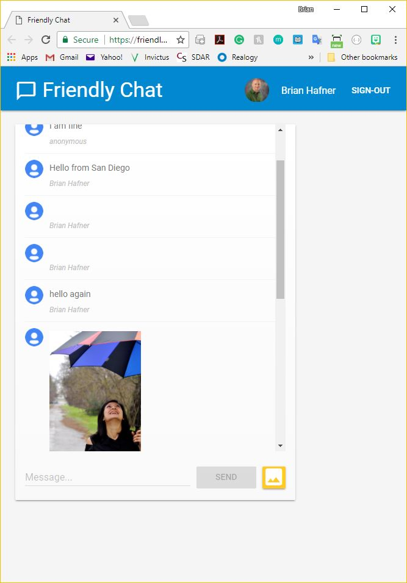

# Firebase Friendly Chat

This project builds a web chat app using five Firebase components: Realtime Database, Cloud Storage, Authentication, Static Hosting and Cloud Messaging.

You can view a working version of the app on Firebase hosting:
https://friendlychat-9c556.firebaseapp.com/

It is based on the Google Code Labs tutorial:
https://codelabs.developers.google.com/codelabs/firebase-web/#0

